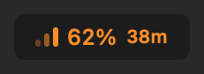
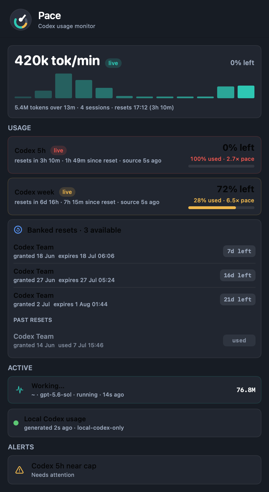

# Pace

Native macOS menu bar meter for OpenAI Codex and ChatGPT quota - live thrust, cap ETA, and the reset-credit ledger.





## Why Pace

OpenAI's credits endpoint only returns *available* reset credits. The moment one is redeemed or expires it vanishes from the response, and no supported surface shows you where it went ([openai/codex#29618](https://github.com/openai/codex/issues/29618) asked for credit detail; the app now shows available credits and expiry, but still no history).

Pace keeps a local ledger, so every credit you redeem or let lapse is recorded with a timestamp. Your history stays yours.

It also reads the wire-level rate limits that actually gate the Codex engine - the same numbers Codex streams into its own session logs - which, since the July 2026 unified ChatGPT app, can differ substantially from what the app's Usage panel shows.

## Features

- Live thrust bars in the menu bar (2s latency whilst a session writes, zero cost idle)
- One big quota percentage
- Conditional cap ETA (e.g. "empty in 38m" only when the burn would beat the reset)
- Fumes state: "0% fumes" in amber when the meter is exhausted but the server is still landing requests, red only when they actually bounce
- Popover with 15-minute thrust chart
- 5-hour and weekly quota pools, including multiple weekly pools
- Banked reset credits with expiry dates and full redeemed/expired history
- Recent sessions from local Codex CLI logs
- Read-only Sesh automatic instrument cluster for route, urgency, worker, token,
  and verification evidence

## How It Works / Privacy

Pace reads from:

- `~/.codex/sessions` rollout JSONLs (local Codex CLI session logs)
- `~/.codex/auth.json` (your local Codex credential file)

Pace calls only OpenAI's own usage endpoints, authenticated with your existing token. It makes no third-party calls, stores no telemetry, and sends nothing off the Mac. Session history, burn rates, and the reset ledger are computed and stored locally.

### Sesh evidence bridge

Pace and Sesh are integrated, but their responsibilities stay separate. Sesh is
the automatic transmission. Pace is the instrument cluster. Pace never chooses
a model, effort, speed tier, topology, worker count, or verification depth.

Local builds can independently aggregate Sesh's private sanitized decision log:

```bash
.build/debug/Headroom --sesh-proof
```

The bridge is read-only. Schema-2 conductor telemetry reports verified runs,
complete provider-thread and task-tree token coverage, provider turns, topology,
workers, routes, escalations, latency, and protected-floor violations. It never
changes a live route and never displays raw prompts, responses, commands, paths,
or provider thread identifiers.

The authoritative local counter is provider-reported cumulative
`tokenUsage.total`, aggregated across every provider thread in the measured task. Pace
does not label tokens as credits or quota savings because no authoritative
per-task local credit counter is available.

The corrected nine-session Slow/Auto experiment remains visible only as a
failed retired single-route baseline. Its 9 of 9 quality result does not rescue
the product verdict: the worst Slow task used 30.8 percent more tokens, Auto's
uncached tokens were 20.7 percent higher, and cache sensitivity failed. Its Fast
comparison was a derived 2.5x proxy, not an observed Fast run, credits, or
quota. It does not calibrate the new conductor.

### Managed sessions

Sesh is always on for ordinary Codex New Tasks through the global conductor
contract and pinned worker profiles. There is no mode selector to remember.

For full workspace-scoped lifecycle and complete task-tree measurement, Pace
also opens Sesh-managed Codex tasks:

1. Choose one scoped project folder.
2. Use **Start Managed Task** or **Resume Managed Task** for that project's
   saved Sesh conversation.
3. Use **New Managed Task** only when a fresh provider conversation is wanted
   and the saved managed context should not be resumed.

Sesh classifies the task locally, then starts exactly one direct provider role.
One-file mechanical edits and uncertain read-only discovery use Terra Low,
ordinary bounded implementation uses Terra Medium, and protected tasks or a
trusted quality-failure escalation use Sol Ultra. OpenAI Standard
is the default service tier. Fast is eligible only when the task itself
expresses immediate urgency and fresh complete capacity evidence supports it.

A native New Task receives the automatic policy and works directly on the model
already selected by Codex. A managed task lets Sesh select the economical direct
model before launch and adds the complete measurement boundary. It is not a
different driving mode.

The Sesh controller is embedded inside `Pace.app`; no separate Sesh menu-bar app
is required. The local installer also keeps `~/bin/sesh` as a command-line entry
point into the bundled controller while preserving `~/.config/sesh` state. It
also installs one owned Sesh block into `~/.codex/AGENTS.md` and three pinned
worker profiles without replacing unrelated Codex instructions or agents. The
unified local package is Pace 1.3.0 build 130 and bundles Sesh 4.2.0.

## Install

### Option A: Download from Releases

Download the notarised `.zip` from [Releases](https://github.com/iamitp/pace/releases), unzip, and drag `Pace.app` to `/Applications`.

### Option B: Brew

```bash
brew install --cask iamitp/tap/pace
```

### Option C: Build from Source

```bash
./script/build_and_run.sh
```

The build script generates a deterministic macOS `.icns` app icon and embeds it, along with a privacy manifest.

## Requirements

- macOS 13 or later
- Codex CLI installed and signed in, or the ChatGPT/Codex desktop app signed in

## FAQ

**Why does Pace disagree with the ChatGPT app's Usage panel?**

They are different meters. Since the July 2026 unification, the app's Usage panel reports the shared agentic pool, while the Codex engine's own sessions stream wire-level `rate_limits` that can sit at a very different number (observed 60+ points apart on launch day - and we have watched sessions sail past a full 5h wire meter and keep billing the weekly one). No single number tells the whole story, so Pace watches the wire meters across every pool (5h, weekly, extras) and shows you what is actually draining.

**Does Pace support Claude Code?**

An experimental combined mode exists - toggle "Also track Claude Code" in the settings menu, or set `PACE_CODEX_ONLY=0`. Codex-only is the default and better tested.

**What do the menu bar elements mean?**

The bars are live thrust (token flow over the last few minutes, faded-to-solid). The big number is the percentage of the 5-hour window remaining. The small number appears only when it matters: a dim countdown to the reset when you are low, or a bold cap ETA when your current burn would empty the window before the reset rescues you.

**Why does it say "0% fumes" instead of just 0%?**

Because 100% on the meter is a report, not a cutoff. The 5-hour window is rolling and enforcement happens per request, so a session can keep working at "0% left" whilst capacity trickles back. Pace reads the server's actual verdict (`rate_limit_reached_type`) from the live session log: amber "fumes" means requests are still landing, red means they have actually started bouncing.

## Licence

MIT. Copyright (c) 2026 Amit Patnaik.
